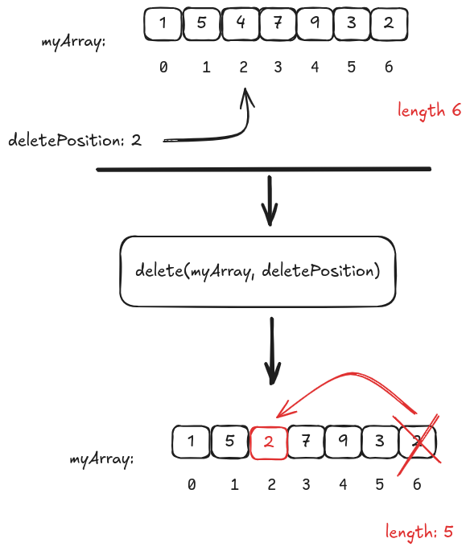

This is an example of a function that removes an array element by position.

Here is the diagram of the deletion logic implemented:



## Development

This project is using [foundry](https://github.com/foundry-rs/foundry)

## Testing

Run:

```bash
$ forge test
```
